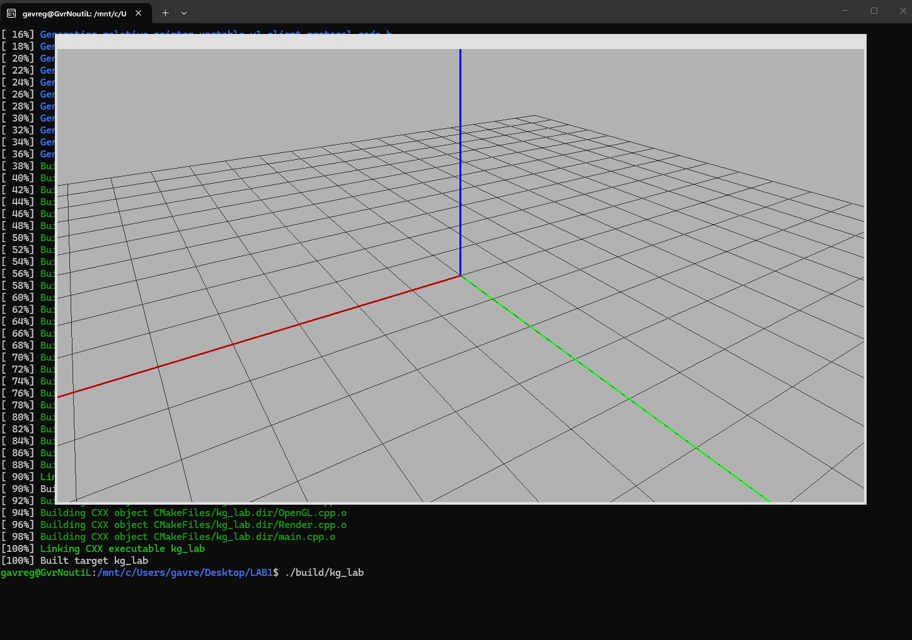

Проекты в репозитории:
- LAB1  первая л/р
- LAB2_training тренировка для второй л/р
- LAB2 вторая л/р
- LAB4+ (в разработке) проект с поддержкой шейдеров (для курсовой)

Внутри каждой папки  лежит CMakeLists.txt
Необходимо сначала сконфигурировать проект с помощью CMake (который нужно установить), выполнив команду

```bash
cmake -B build
```

В папке build будут созданы материалы для компиляции в зависимости от ОС и установленных средств разработки.

Сборку можно также произвести через CMake (по факту CMake ничего не собирает, а управляет тем, что установлено):

```
cmake --build build
```

Скомпилированная программа может располагаться в папке build, build/Debug, и т.д., в зависимости от сборщика.

Ниже инструкции для сборки шаблонов в зависимости от операционных систем.

### Содержание

- [Windows + Visual Studio](#windows--visual-studio)
- [Mac OS](#mac-os)
- [Linux](#linux)
  - [Ubuntu, Debian](#ubuntu-debian)

## Windows + Visual Studio

Для работы в Windows необходимо иметь Visual Studio с установленными компонентами для С++:


Для конфигурации проекта необходимо установить CMake

```powershell
PS > winget install cmake
```

Для создания проекта, необходимо перейти в папку нужной лабораторной работы и сконфигурировать проект командой:

```powershell
PS > cmake -B build
```

<details>

<summary>Полный вывод команды при корректной работе CMake</summary>

```powershell
PS C:\...\LAB2_training> cmake -B build

-- Building for: Visual Studio 18 2026
-- Selecting Windows SDK version 10.0.26100.0 to target Windows 10.0.26200.
-- The C compiler identification is MSVC 19.50.35727.0
-- The CXX compiler identification is MSVC 19.50.35727.0
-- Detecting C compiler ABI info
-- Detecting C compiler ABI info - done
-- Check for working C compiler: C:/Program Files/Microsoft Visual Studio/18/Community/VC/Tools/MSVC/14.50.35717/bin/Hostx64/x64/cl.exe - skipped
-- Detecting C compile features
-- Detecting C compile features - done
-- Detecting CXX compiler ABI info
-- Detecting CXX compiler ABI info - done
-- Check for working CXX compiler: C:/Program Files/Microsoft Visual Studio/18/Community/VC/Tools/MSVC/14.50.35717/bin/Hostx64/x64/cl.exe - skipped
-- Detecting CXX compile features
-- Detecting CXX compile features - done
-- Performing Test CMAKE_HAVE_LIBC_PTHREAD
-- Performing Test CMAKE_HAVE_LIBC_PTHREAD - Failed
-- Looking for pthread_create in pthreads
-- Looking for pthread_create in pthreads - not found
-- Looking for pthread_create in pthread
-- Looking for pthread_create in pthread - not found
-- Found Threads: TRUE
-- Including Win32 support
-- Could NOT find Doxygen (missing: DOXYGEN_EXECUTABLE)
-- Documentation generation requires Doxygen 1.9.8 or later
-- Found OpenGL: opengl32
-- Configuring done (20.0s)
-- Generating done (0.3s)
-- Build files have been written to: C:/.../LAB2_training/build

PS C:\...\LAB2_training> 

```
</details>

CMake обнаружит необходимую версию VS, а также компиляторы С и С++. После чего в папке build будет создано решение.

В решении будет находиться несколько проектов: проекты, необходимые для сборки библиотеки GLFW, и проект для лабораторной работы kg_lab. Его необходимо сделать основным:


Скомпилируйте и запустите решение. Если все сделано верно, то должен получиться такой результат:


**ВАЖНО!!**

Так как конфигурацией проекта занимается CMake, то все изменения необходимо делать через него, в противном случае они будут перезаписаны. Например, если вы хотите добавить в проект новый \*.cpp или \*.h файл, то необходимо его разместить в директории с исходным кодом и перегенерировать проект. CMake автоматически добавит новые файлы к решению.

```powershell
PS > cmake -B build
```

VS определит, что активное решение было изменено и предложит его переоткрыть:


## Mac OS
   Необходимо установить только cmake и компилятор с++. Шаги по работе с Cmake аналогичны Linux, за исключением устновки дополнительных пакетов для сблоки проекта. На маках уже все есть.

  Я попрошу отвественных студентов написать мне тут интсрукцию с действиями по запуску проекта на стеке, отличном от Windows-VisualStudio чтобы облегчиьт жизнь будущим поколениям.
## Linux 
 ### Ubuntu, Debian

Вначале необходимо установить cmake и любой С++ компилятор (gcc или clang).

 ```bash
@.../$ sudo apt update 

@.../$ sudo apt install -y gcc
 #или
@.../$ sudo apt install -y clang

@.../$ apt install -y make cmake
 ```

Для работы с Open GL и сборки библиотеки glfw, которая используется для создание окна, необходимо установить дополинтельные зависимости

```bash
@.../$ sudo apt install -y libgl1-mesa-dev libxrandr-dev libxinerama-dev libxcursor-dev libxi-dev wayland-protocols libwayland-dev libwayland-bin libxkbcommon-dev libglu1-mesa-dev pkg-config
```

Далее переходим в папку с любой лабораторной работой и конфигурируем ее CMake`ом:

```bash
@.../LAB1$ cmake -B build
```

<details>

<summary> Полный вывод CMake </summary> 

```bash
@.../LAB1$ cmake -B build

-- The C compiler identification is GNU 14.2.0
-- The CXX compiler identification is GNU 14.2.0
-- Detecting C compiler ABI info
-- Detecting C compiler ABI info - done
-- Check for working C compiler: /usr/bin/cc - skipped
-- Detecting C compile features
-- Detecting C compile features - done
-- Detecting CXX compiler ABI info
-- Detecting CXX compiler ABI info - done
-- Check for working CXX compiler: /usr/bin/c++ - skipped
-- Detecting CXX compile features
-- Detecting CXX compile features - done
-- Performing Test CMAKE_HAVE_LIBC_PTHREAD
-- Performing Test CMAKE_HAVE_LIBC_PTHREAD - Success
-- Found Threads: TRUE
-- Including Wayland support
-- Including X11 support
-- Looking for memfd_create
-- Looking for memfd_create - found
-- Found PkgConfig: /usr/bin/pkg-config (found version "1.8.1")
-- Checking for modules 'wayland-client>=0.2.7;wayland-cursor>=0.2.7;wayland-egl>=0.2.7;xkbcommon>=0.5.0'
--   Found wayland-client, version 1.23.1
--   Found wayland-cursor, version 1.23.1
--   Found wayland-egl, version 18.1.0
--   Found xkbcommon, version 1.7.0
-- Found X11: /usr/include
-- Looking for XOpenDisplay in /usr/lib/x86_64-linux-gnu/libX11.so;/usr/lib/x86_64-linux-gnu/libXext.so
-- Looking for XOpenDisplay in /usr/lib/x86_64-linux-gnu/libX11.so;/usr/lib/x86_64-linux-gnu/libXext.so - found
-- Looking for gethostbyname
-- Looking for gethostbyname - found
-- Looking for connect
-- Looking for connect - found
-- Looking for remove
-- Looking for remove - found
-- Looking for shmat
-- Looking for shmat - found
-- Could NOT find Doxygen (missing: DOXYGEN_EXECUTABLE)
-- Documentation generation requires Doxygen 1.9.8 or later
-- Found OpenGL: /usr/lib/x86_64-linux-gnu/libOpenGL.so
-- Configuring done (59.0s)
-- Generating done (1.8s)
-- Build files have been written to: /.../LAB1/build
```
</details>

В папке build будет находится makefile с командами для сборки проекта. запустить его можно через CMake
```bash
@.../LAB1$ cmake --build build
```
или вручную:
```bash
.../LAB1$ cd LAB1
@.../LAB1$ make
```

<details> 
<summary>Лог сборки c gcc</summary>

```bash
@.../LAB1$ cmake --build build
[  2%] Generating xdg-shell-client-protocol.h
[  4%] Generating fractional-scale-v1-client-protocol-code.h
[  6%] Generating fractional-scale-v1-client-protocol.h
[  8%] Generating idle-inhibit-unstable-v1-client-protocol-code.h
[ 10%] Generating idle-inhibit-unstable-v1-client-protocol.h
[ 12%] Generating pointer-constraints-unstable-v1-client-protocol-code.h
[ 14%] Generating pointer-constraints-unstable-v1-client-protocol.h
[ 16%] Generating relative-pointer-unstable-v1-client-protocol-code.h
[ 18%] Generating relative-pointer-unstable-v1-client-protocol.h
[ 20%] Generating viewporter-client-protocol-code.h
[ 22%] Generating viewporter-client-protocol.h
[ 24%] Generating wayland-client-protocol-code.h
[ 26%] Generating wayland-client-protocol.h
[ 28%] Generating xdg-activation-v1-client-protocol-code.h
[ 30%] Generating xdg-activation-v1-client-protocol.h
[ 32%] Generating xdg-decoration-unstable-v1-client-protocol-code.h
[ 34%] Generating xdg-decoration-unstable-v1-client-protocol.h
[ 36%] Generating xdg-shell-client-protocol-code.h
[ 38%] Building C object _deps/glfw-build/src/CMakeFiles/glfw.dir/context.c.o
[ 40%] Building C object _deps/glfw-build/src/CMakeFiles/glfw.dir/init.c.o
[ 42%] Building C object _deps/glfw-build/src/CMakeFiles/glfw.dir/input.c.o
[ 44%] Building C object _deps/glfw-build/src/CMakeFiles/glfw.dir/monitor.c.o
[ 46%] Building C object _deps/glfw-build/src/CMakeFiles/glfw.dir/platform.c.o
[ 48%] Building C object _deps/glfw-build/src/CMakeFiles/glfw.dir/vulkan.c.o
[ 50%] Building C object _deps/glfw-build/src/CMakeFiles/glfw.dir/window.c.o
[ 52%] Building C object _deps/glfw-build/src/CMakeFiles/glfw.dir/egl_context.c.o
[ 54%] Building C object _deps/glfw-build/src/CMakeFiles/glfw.dir/osmesa_context.c.o
[ 56%] Building C object _deps/glfw-build/src/CMakeFiles/glfw.dir/null_init.c.o
[ 58%] Building C object _deps/glfw-build/src/CMakeFiles/glfw.dir/null_monitor.c.o
[ 60%] Building C object _deps/glfw-build/src/CMakeFiles/glfw.dir/null_window.c.o
[ 62%] Building C object _deps/glfw-build/src/CMakeFiles/glfw.dir/null_joystick.c.o
[ 64%] Building C object _deps/glfw-build/src/CMakeFiles/glfw.dir/posix_module.c.o
[ 66%] Building C object _deps/glfw-build/src/CMakeFiles/glfw.dir/posix_time.c.o
[ 68%] Building C object _deps/glfw-build/src/CMakeFiles/glfw.dir/posix_thread.c.o
[ 70%] Building C object _deps/glfw-build/src/CMakeFiles/glfw.dir/x11_init.c.o
[ 72%] Building C object _deps/glfw-build/src/CMakeFiles/glfw.dir/x11_monitor.c.o
[ 74%] Building C object _deps/glfw-build/src/CMakeFiles/glfw.dir/x11_window.c.o
[ 76%] Building C object _deps/glfw-build/src/CMakeFiles/glfw.dir/xkb_unicode.c.o
[ 78%] Building C object _deps/glfw-build/src/CMakeFiles/glfw.dir/glx_context.c.o
[ 80%] Building C object _deps/glfw-build/src/CMakeFiles/glfw.dir/wl_init.c.o
[ 82%] Building C object _deps/glfw-build/src/CMakeFiles/glfw.dir/wl_monitor.c.o
[ 84%] Building C object _deps/glfw-build/src/CMakeFiles/glfw.dir/wl_window.c.o
[ 86%] Building C object _deps/glfw-build/src/CMakeFiles/glfw.dir/linux_joystick.c.o
[ 88%] Building C object _deps/glfw-build/src/CMakeFiles/glfw.dir/posix_poll.c.o
[ 90%] Linking C static library libglfw3.a
[ 90%] Built target glfw
[ 92%] Building CXX object CMakeFiles/kg_lab.dir/Camera.cpp.o
[ 94%] Building CXX object CMakeFiles/kg_lab.dir/OpenGL.cpp.o
[ 96%] Building CXX object CMakeFiles/kg_lab.dir/Render.cpp.o
[ 98%] Building CXX object CMakeFiles/kg_lab.dir/main.cpp.o
[100%] Linking CXX executable kg_lab
[100%] Built target kg_lab
```

</details>

После успешной компиляции в пвпке build будет распологаться исполняемый файл kg_lab.

В папке build будут располагатся только команды, необходимые для сборки проекта. Вся работа осуществялется в *.cpp и в *.h файлах в нужной папке лабы. Перед каждой компиляцией и сборкой программы **не нужно** переконфигурировать (```cmake -B```) проект, нужно его пересобирать (```cmake --build``` или ```make```).

Повторно запускать ```cmake -B``` необходимо только если изменился состав исходников (добавлены новые, удалены текущие) или если вы перенесли проект в другую папку. Папка build должна оставатся только на вашем компьютере и не должна попасть в архив с программой, если вы ее гдето размещаете или кому то отправляете. 

*Собирается и запускается даже на WSL*

